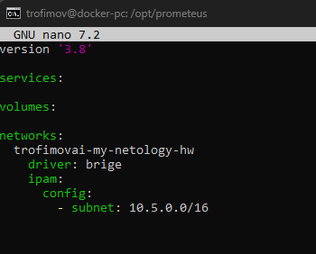

Домашнее задание к занятию «Docker. Часть 2»
https://github.com/netology-code/sdvps-homeworks.git

    Задание 1
Docker Compose - это инструмент для запуска многоконтейнерных приложений. Он нужен для упращения запуска, если контейнеров больше 1. Описание структуры приложения идет в файле docker-compose.yml

    Задание 2

